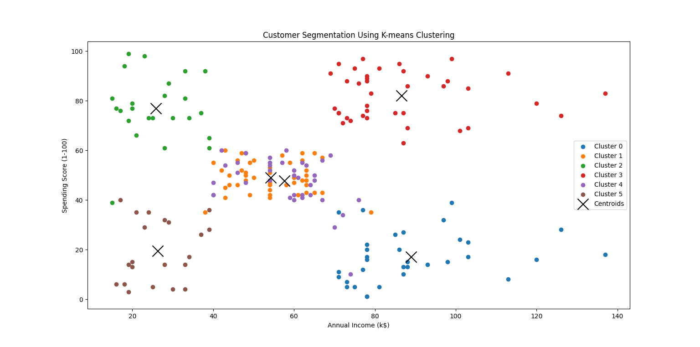
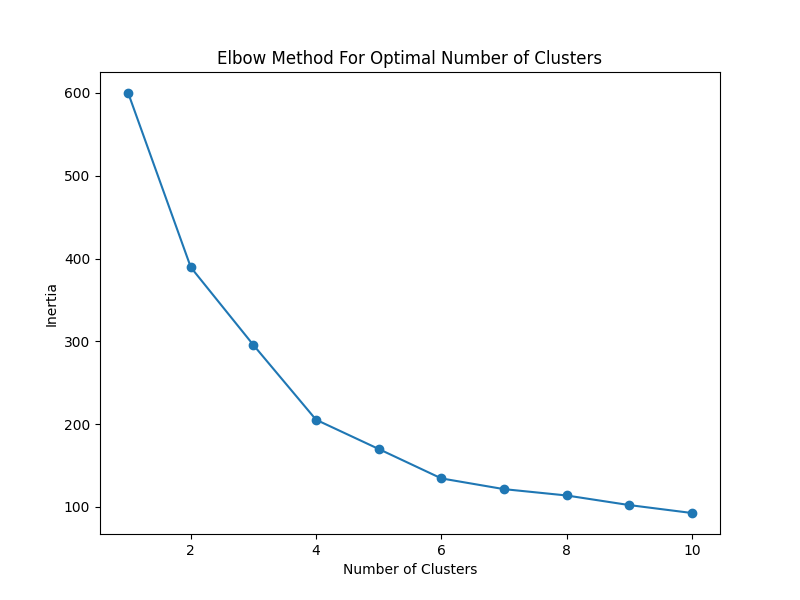
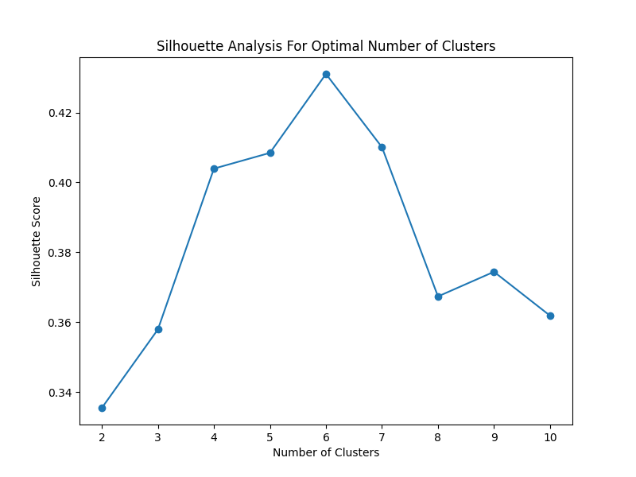
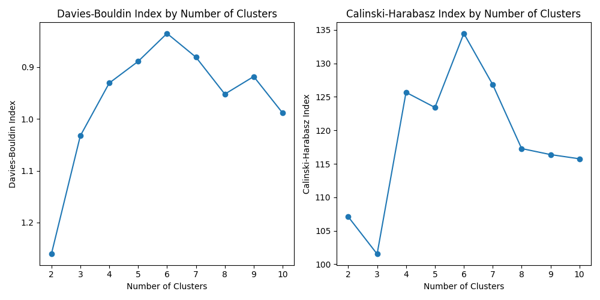
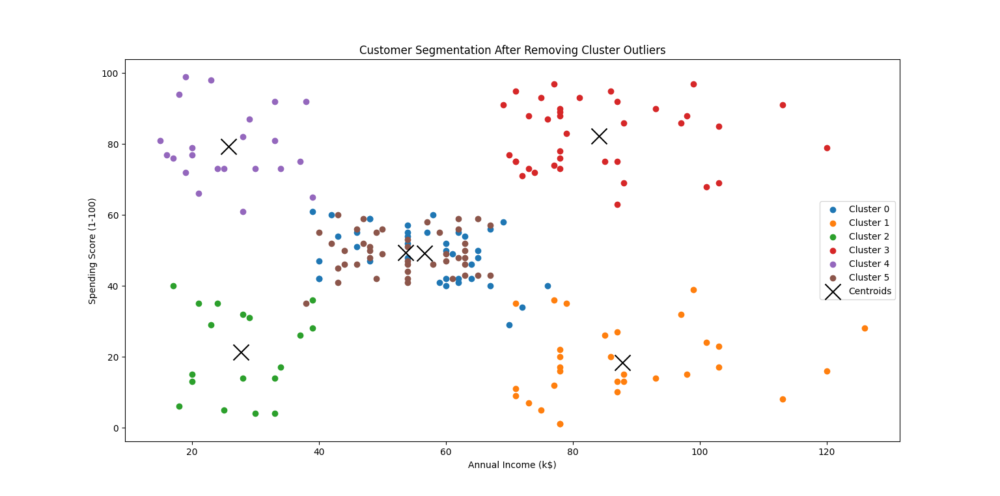

# Mall Customer Segmentation

This project focuses on segmenting customers of a mall based on their spending behavior, annual income and age. By applying various clustering techniques, we aim to identify distinct customer groups on which we can then apply various marketing strategies. The goal is to provide insights that can help the mall's management better understand how their customers think and spend in order to efficiently make adjustments to the mall's current business plan.

We experimented with three different clustering models — K-means, DBSCAN, and Gaussian Mixture Models — in a separate analysis file (clustering_try.py). After comparing their performance using metrics like the Silhouette Score, we selected the K-means algorithm for the final model in the main analysis, as it provided the best balance between cluster separation and interpretability.

## Table of Contents
- [Project Overview](#project-overview)
- [Dataset](#dataset)
- [Methods and Techniques](#methods-and-techniques)
- [Evaluation Metrics](#evaluation-metrics)
- [Business Insights](#business-insights)
- [Conclusion](#conclusion)
- [Future Work](#future-work)

## Dataset

The dataset used in this project is the "Mall Customers" dataset, which contains information about 200 customers from a mall. The dataset was sourced from [Kaggle](https://www.kaggle.com/vjchoudhary7/customer-segmentation-tutorial-in-python).

### Features:

- **CustomerID:** A unique identifier assigned to each customer.
- **Gender:** The gender of the customer (Male or Female).
- **Age:** The age of the customer.
- **Annual Income (k$):** The annual income of the customer in thousand dollars.
- **Spending Score (1-100):** A score assigned by the mall based on customer behavior and spending patterns.

### Data Preprocessing:

- **Handling Missing Values:** The dataset did not contain any missing values, so no imputation was necessary.
- **Feature Scaling:** We used `StandardScaler` to scale the numerical features (Age, Annual Income, and Spending Score) to ensure that the clustering algorithms performed optimally.

### Outlier Detection and Removal:

- **Initial Clustering:** We first applied the K-means clustering algorithm to segment the customers into groups. After evaluating the clustering results, we identified and removed outliers that were distorting the cluster centroids and negatively impacting the quality of the clusters.
- **Refined Clustering:** Following the removal of outliers, we re-applied the K-means algorithm, which resulted in more distinct and meaningful clusters, as indicated by improved clustering metrics like the Silhouette Score.

## Methods and Techniques

This project employed a series of clustering techniques to segment the mall customers based on their spending behavior and annual income. The main steps and methodologies used are detailed below:

### Clustering Algorithms:

- **K-means Clustering:**
  - K-means was the primary algorithm used for customer segmentation. Initially, we applied K-means with a varying number of clusters (1 to 10) and evaluated the model's performance using the Elbow Method, Silhouette Analysis, Calinski-Harabasz Index, and Davies-Bouldin Index. The optimal number of clusters was identified as 6 based on these metrics.
  - After the initial clustering, we detected outliers by calculating the Euclidean distance of each point from its respective cluster centroid. Outliers, defined as points in the top 5% of distances, were removed to refine the clusters.
  - We then re-applied the K-means algorithm to the cleaned dataset, which improved the clustering results slightly, as indicated by a marginal increase in the Silhouette Score.

  

- **DBSCAN (Density-Based Spatial Clustering of Applications with Noise):**
- DBSCAN was explored as an alternative to K-means. This method is particularly effective at identifying clusters of varying shapes and sizes and can also detect noise (outliers). However, in this dataset, DBSCAN did not perform as well, likely due to the structured nature of the data, resulting in a lower Silhouette Score compared to K-means.

- **Gaussian Mixture Models (GMM):**
  - GMM was tested to model the data as a mixture of several Gaussian distributions. This probabilistic approach provided a different perspective on the data, but its performance was slightly lower than K-means in terms of the Silhouette Score.

- **Outlier Detection and Removal:**
  - Outliers were identified post-clustering, based on the distance from the cluster centroids. By removing these outliers and reapplying K-means, the model produced more distinct clusters. This iterative approach was crucial in enhancing the model's performance.

### Dimensionality Reduction:

- **Principal Component Analysis (PCA):**
  - Although not explicitly shown in the final visualization, PCA was used for exploratory analysis to understand the spread and distribution of clusters in a lower-dimensional space. This helped in visually validating the clustering structure.

### Evaluation Metrics:

- **Inertia:** Used as a measure of how well the clusters are formed, with lower values indicating tighter clusters.

  

  The Elbow Method plot shows the inertia for different numbers of clusters. The "elbow" point indicates that adding more clusters beyond this point provides diminishing returns in terms of inertia reduction.

- **Silhouette Score:** Evaluated how similar each point is to its own cluster compared to other clusters, with scores closer to 1 indicating better-defined clusters.

  

  The Silhouette Score plot helps determine the optimal number of clusters by measuring how well-separated the clusters are. Higher scores suggest better clustering.

- **Calinski-Harabasz Index:** Used to assess the variance ratio between clusters, with higher values indicating better clustering.
  The Calinski-Harabasz Index plot shows how the variance between clusters changes as the number of clusters increases. A higher index value indicates more distinct clustering.

- **Davies-Bouldin Index:** Measures the average similarity ratio of each cluster with the cluster that is most similar to it, with lower values indicating better clustering.

  

  The Davies-Bouldin Index plot shows the average similarity of clusters to their most similar cluster. Lower values suggest better-defined clusters.

### Tools and Libraries:

- **Python:** The programming language used to implement the analysis.
- **Pandas:** For data manipulation and preprocessing.
- **scikit-learn:** The primary library used for clustering algorithms, scaling, and model evaluation.
- **Seaborn and Matplotlib:** For data visualization, including histograms, boxplots, scatter plots, and radar charts.

### Final Model Selection:

After comparing the performance of K-means with and without outlier removal, K-means with 6 clusters after outlier removal was selected as the final model. This decision was based on the balance between clustering quality and interpretability, providing actionable insights for customer segmentation.

  

## Business Insights

The clustering analysis revealed six distinct customer segments based on their spending behavior and annual income. Each segment represents a unique group of customers that the mall can target with specific marketing strategies. Below are the key insights and recommendations for each cluster:

- **Cluster 0:** Medium Income, Medium Spending
  - **Insight:** This group represents the average customer, with balanced income and spending behavior. They are consistent shoppers who can be targeted with regular promotions and loyalty programs to maintain their engagement.
  - **Recommendation:** Introduce loyalty cards and discounts on frequent purchases, encouraging repeat business.

- **Cluster 1:** High Income, High Spending
  - **Insight:** These customers are the most valuable, with high disposable income and a willingness to spend. They are likely to be interested in premium products and exclusive offers.
  - **Recommendation:** Offer premium memberships, early access to sales, and exclusive events tailored to this segment.

- **Cluster 2:** Low Income, High Spending
  - **Insight:** Despite having lower income, these customers have a high spending score, possibly due to a focus on specific high-value purchases or lifestyle preferences.
  - **Recommendation:** Target this group with value-oriented promotions and personalized discounts on popular products to maximize their spending.

- **Cluster 3:** High Income, Low Spending
  - **Insight:** Customers in this segment have the financial capacity to spend more but currently have low spending behavior. They may need more incentives to increase their spending.
  - **Recommendation:** Implement targeted marketing campaigns with special offers and upsell strategies, such as bundling products or providing personalized recommendations.

- **Cluster 4:** Low Income, Low Spending
  - **Insight:** This segment represents budget-conscious shoppers who are less likely to make high-value purchases.
  - **Recommendation:** Focus on affordable products and budget-friendly deals. Consider creating discount days or partnering with discount brands to attract this segment.

- **Cluster 5:** Older Age, Moderate Income, Moderate Spending
  - **Insight:** This group consists of older customers with moderate income and spending. They may prioritize value for money and tend to be more conservative in their purchasing habits.
  - **Recommendation:** Offer discounts on essential items and promote loyalty programs that offer rewards for regular shopping. Consider senior-friendly marketing campaigns or product offerings.

## Conclusion

This project successfully segmented mall customers into six distinct groups using K-means clustering, with supplementary analysis using DBSCAN and Gaussian Mixture Models. By refining the clusters through outlier removal, we were able to identify key customer segments, each with unique characteristics and behaviors.

### Key Takeaways:

- **Effective Segmentation:** The analysis revealed distinct customer groups that can be targeted with tailored marketing strategies, potentially leading to increased customer engagement and revenue.
- **Model Refinement:** The iterative process of removing outliers and reapplying clustering algorithms improved the quality of the clusters, as evidenced by a slight increase in the Silhouette Score.
- **Actionable Insights:** The business insights derived from the clustering analysis provide a clear roadmap for the mall's management to optimize their marketing strategies.

### Limitations:

- **Limited Features:** The analysis was based on a limited set of features (Age, Annual Income, Spending Score). Including additional features such as purchasing history, customer preferences, and frequency of visits could provide a more comprehensive understanding of customer behavior.
- **Static Analysis:** The analysis was based on a static dataset. Future work could involve applying clustering techniques to dynamic data, allowing for real-time customer segmentation.

### Future Work:

- **Incorporate Additional Data:** Expanding the dataset to include more variables, such as transaction history and customer feedback, could enhance the clustering results.
- **Explore Other Clustering Techniques:** Further exploration of advanced clustering techniques, such as hierarchical clustering or spectral clustering, may yield even better results.
- **Real-Time Segmentation:** Implementing real-time data analysis to continuously update customer segments could help the mall respond more quickly to changes in customer behavior.

By applying these future improvements, the mall can continue to refine its understanding of customer segments and further optimize its marketing strategies.
