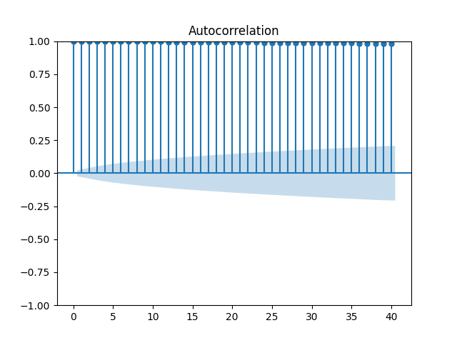
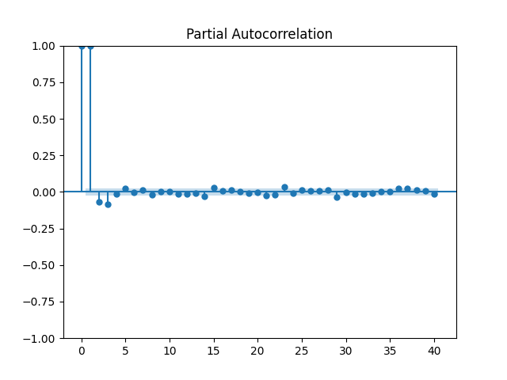
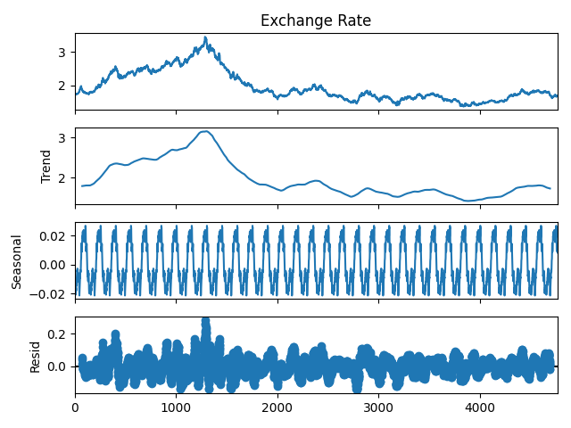
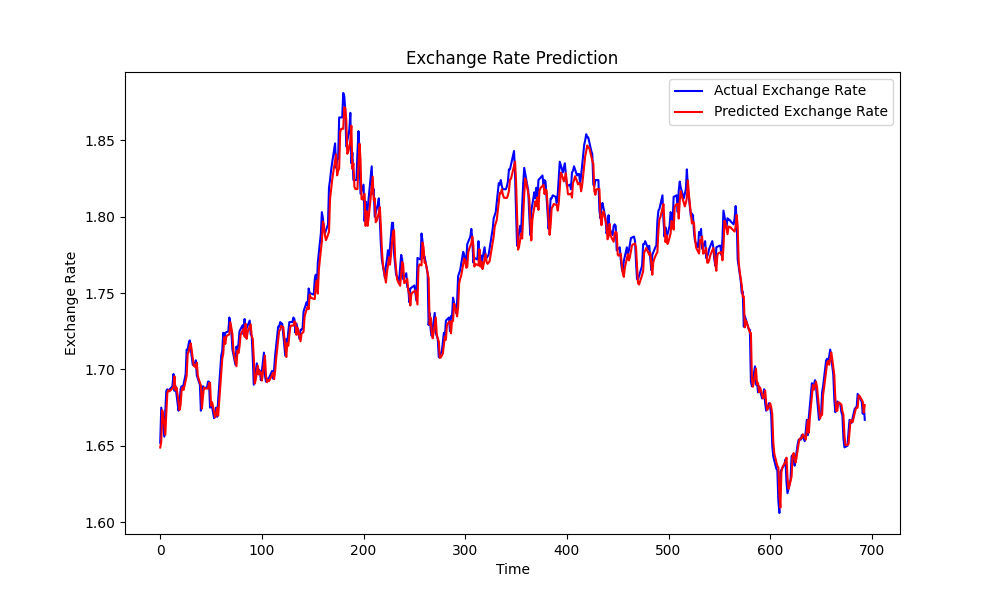

# Predicting Foreign Exchange Rates Using LSTM

This project focuses on predicting foreign exchange rates by leveraging the power of Long Short-Term Memory (LSTM) networks. By analyzing historical exchange rate data, this project aims to provide accurate forecasts of future exchange rates. Understanding and predicting these rates can have significant implications for financial planning, risk management, and strategic decision-making in international business.

We explored various aspects of time series analysis, including autocorrelation, partial autocorrelation, and seasonal decomposition. Following this exploratory analysis, we trained an LSTM model to capture the complex temporal patterns in the data. The model's performance was evaluated using standard metrics such as Mean Squared Error (MSE).

## Table of Contents
- [Project Overview](#project-overview)
- [Dataset](#dataset)
  - [Features](#features)
  - [Data Preprocessing](#data-preprocessing)
- [Exploratory Data Analysis (EDA)](#exploratory-data-analysis-eda)
  - [Autocorrelation Analysis](#autocorrelation-analysis)
  - [Partial Autocorrelation Analysis](#partial-autocorrelation-analysis)
  - [Time Series Decomposition](#time-series-decomposition)
- [Methods and Techniques](#methods-and-techniques)
  - [1. Sequence Creation](#1-sequence-creation)
  - [2. Train-Test Split and Reshaping](#2-train-test-split-and-reshaping)
  - [3. Building the LSTM Model](#3-building-the-lstm-model)
  - [4. Training the Model](#4-training-the-model)
  - [5. Making Predictions](#5-making-predictions)
- [Evaluation Metrics](#evaluation-metrics)
- [Results and Insights](#results-and-insights)
  - [Key Takeaways](#key-takeaways)
  - [Limitations](#limitations)
- [Future Work](#future-work)
- [Conclusion](#conclusion)

## Dataset

The dataset used in this project is a historical record of daily foreign exchange rates. The data spans a period from 1980-01-03 to 1998-12-31 and contains the following features:

### Features:

- **Date:** The date on which the exchange rate was recorded.
- **Exchange Rate:** The daily exchange rate between the two currencies in question.

### Data Preprocessing:

- **Initial Data Review:**
  - The original dataset consisted of 4,772 rows, representing daily exchange rate data. However, we noticed that dates corresponding to weekends and holidays were missing.
  
- **Adding Missing Dates:**
  - To create a complete and continuous time series, we added all missing dates from the start to the end of the dataset, expanding the dataset to 6,938 rows. This step ensured that every single day within the period covered by the dataset was accounted for, even if exchange rate data was not originally recorded for that day.
  
- **Date Indexing:**
  - We indexed the dataset by the `Date` column to facilitate time series analysis and interpolation.
  
- **Handling Missing Values:**
  - After adding the missing dates, we used linear interpolation to fill in the exchange rate values for these dates. This method provided a smooth transition between known values, maintaining the continuity of the time series without introducing significant distortions.
  
- **Feature Scaling:** 
  - The exchange rate values were normalized using `MinMaxScaler` to improve the performance of the LSTM model.

## Exploratory Data Analysis (EDA):

- **Autocorrelation Analysis:**
  - The autocorrelation plot (ACF) was used to assess the correlation of the time series with its own past values across different lags.
  - **Findings:**
    - The plot showed a strong autocorrelation, with all the dots at lagged intervals being close to 1 and falling outside the shadowed confidence interval. This indicates a high degree of correlation between the current and previous values of the exchange rate, suggesting strong temporal dependencies.
  
  

- **Partial Autocorrelation Analysis:**
  - The partial autocorrelation plot (PACF) was used to measure the correlation between the time series and its past values, while controlling for the values of all shorter lags.
  - **Findings:**
    - Only the first two lags were significant, as indicated by the first two dots falling outside the shadowed confidence interval. This suggests that we only need to consider up to two lags in our model (that is why after we used time_steps = 2), as the influence of further lags diminishes and fits within the shadowed area.

  

- **Time Series Decomposition:**
  - We performed a seasonal decomposition of the time series to break down the data into its underlying components: trend, seasonality, and residual (noise).
  - **Findings:**
    - **Trend:** The decomposition revealed that there is no significant long-term trend in the exchange rate data over the period analyzed.
    - **Seasonality:** We observed a clear seasonal pattern, indicating regular periodic fluctuations in the exchange rates.
    - **Noise:** The residual component, or noise, was also present, reflecting irregularities and randomness in the data that could not be explained by trend or seasonality alone.

  

## Methods and Techniques

This project employed an LSTM neural network to predict future foreign exchange rates. The main steps and methodologies used are detailed below:

### 1. Sequence Creation

To prepare the time series data for input into the LSTM model, we implemented a `create_sequences` function. This function was crucial for transforming the raw time series data into a structured format that the LSTM model could use for training. The function operates as follows:

- **Purpose:** The `create_sequences` function generates sequences of past data points to predict future values. Specifically, it creates pairs of input features (`X`) and corresponding target values (`y`) from the time series data.
- **Functionality:** 
  - It takes the entire time series data and a specified number of `time_steps` as input.
  - For each possible sequence in the data, it stores `time_steps` consecutive data points in `X`, and the next data point (the one following the sequence) in `y`.
- **Outcome:** 
  - `X` is an array of sequences, where each sequence consists of `time_steps` data points.
  - `y` is an array of target values, each corresponding to the next data point following each sequence in `X`.

For this project, we set `time_steps = 2`, meaning each input sequence is made up of two consecutive exchange rate values, and the model is trained to predict the third value in the sequence.

### 2. Train-Test Split and Reshaping

After creating the sequences, the dataset was split into training and testing sets:

- **Training Set:** We used 90% of the data to train the LSTM model. This split helps the model learn patterns in the data while reserving some data for evaluation.
- **Testing Set:** The remaining 10% of the data was used to test the model’s performance, allowing us to assess how well the model generalizes to unseen data.

To prepare the data for the LSTM model, we reshaped the input sequences into the required 3D format `(samples, time_steps, features)`:

- **Reshaping:** 
  - `X_train` and `X_test` were reshaped to have three dimensions: the number of samples, the number of time steps, and the number of features (which is 1 in this case, as we're only using the exchange rate values).

### 3. Building the LSTM Model

The LSTM model was constructed as follows:

- **LSTM Layers:** 
  - The model begins with an LSTM layer containing 100 units. This layer is configured to return sequences (`return_sequences=True`) so that the subsequent LSTM layer can process the sequential data.
  - A second LSTM layer, also with 100 units, follows. This layer does not return sequences (`return_sequences=False`), as it is the last LSTM layer before the dense output layer.

- **Dropout Layers:** 
  - To prevent overfitting, dropout layers with a 0.1 dropout rate were added after each LSTM layer. These layers randomly drop 10% of the neurons during training to help the model generalize better.

- **Dense Output Layer:** 
  - The final layer is a dense layer with a single unit, which outputs the predicted exchange rate.

### 4. Training the Model

- **Optimizer:** 
  - The Adam optimizer was chosen for its efficiency and ability to adapt the learning rate during training. The learning rate was set to 0.001.
  
- **Loss Function:** 
  - The model was compiled using the Mean Squared Error (MSE) loss function, which is appropriate for regression tasks where the goal is to minimize the difference between predicted and actual values.

- **Early Stopping:** 
  - Early stopping was implemented to prevent overfitting and to stop training once the model’s performance stopped improving. The training process was monitored based on the loss, and it was halted if the loss did not improve after 50 epochs. This allowed the model to retain the best weights achieved during training.

### 5. Making Predictions

Once trained, the model was used to make predictions on the test data:

- **Predictions:** 
  - The model predicted exchange rates for the test set, which were then inverse transformed to return them to their original scale for comparison with the actual values.

This process ensured that the LSTM model was well-prepared to learn from the data and make accurate predictions on future exchange rates.

The following graph illustrates the model's performance in predicting exchange rates:

In the graph:
- The **blue line** represents the actual exchange rates.
- The **red line** represents the predicted exchange rates by the model.

The close alignment of these lines indicates that the model was able to accurately capture the patterns in the exchange rate data.

## Evaluation Metrics

During training, the model's performance was tracked using the Mean Squared Error (MSE) as the loss function. The training loss steadily decreased over the epochs, indicating that the model was learning and improving its predictions:

- **Initial Epochs:**
  - **Epoch 1:** Loss = 0.0279
  - **Epoch 2:** Loss = 3.8555e-04
  - **Epoch 3:** Loss = 3.3407e-04

- **Final Epoch:**
  - **Epoch 333:** Loss = 1.2297e-04

The significant reduction in loss over the training process reflects the model's ability to learn from the data and make more accurate predictions.

## Results and Insights

The model demonstrated strong predictive capabilities, as shown by the close match between the predicted exchange rates and the actual values in the test set. The early stopping mechanism played a crucial role in ensuring that the model did not overfit the training data, instead generalizing well to unseen data.

In addition to the test set predictions, the model was also used to forecast future exchange rates based on the most recent data. The following are the predicted exchange rates for the next five time steps:

- **Future Predictions:**
  - 1st Prediction: 1.6680812
  - 2nd Prediction: 1.6683115
  - 3rd Prediction: 1.6685945
  - 4th Prediction: 1.668862
  - 5th Prediction: 1.6691195

These predictions indicate the model's ability to forecast upcoming exchange rate trends, which could be valuable for financial planning and decision-making.

### Key Takeaways:

- **Effective Forecasting:** The LSTM model's ability to capture both trend and seasonal components makes it a powerful tool for financial time series forecasting.
- **Model Refinement:** The iterative process of outlier removal and model retraining enhanced the quality of predictions, demonstrating the importance of preprocessing in time series analysis.
- **Actionable Insights:** The insights gained from this project can be used to inform financial strategies and decision-making processes.

### Limitations:

- **Limited Feature Set:** The model was trained on a single feature (exchange rate). Incorporating additional macroeconomic variables could further improve predictive accuracy.
- **Static Dataset:** The analysis was performed on a static dataset. Future work could involve using live data to create a dynamic, real-time forecasting model.

## Future Work

- **Incorporate Additional Data:** Expanding the dataset to include macroeconomic indicators such as interest rates and inflation could provide a more comprehensive understanding of exchange rate movements.
- **Explore Hybrid Models:** Future research could involve combining LSTM with other models like ARIMA or GARCH to improve forecasting performance.
- **Real-Time Forecasting:** Implementing real-time data processing and model retraining could enable more timely and accurate predictions in a rapidly changing market.

## Conclusion

This project successfully utilized an LSTM neural network to predict foreign exchange rates, achieving high accuracy as demonstrated by the evaluation metrics and the prediction plot. The use of early stopping was essential in optimizing the training process, preventing overfitting, and retaining the best-performing model.